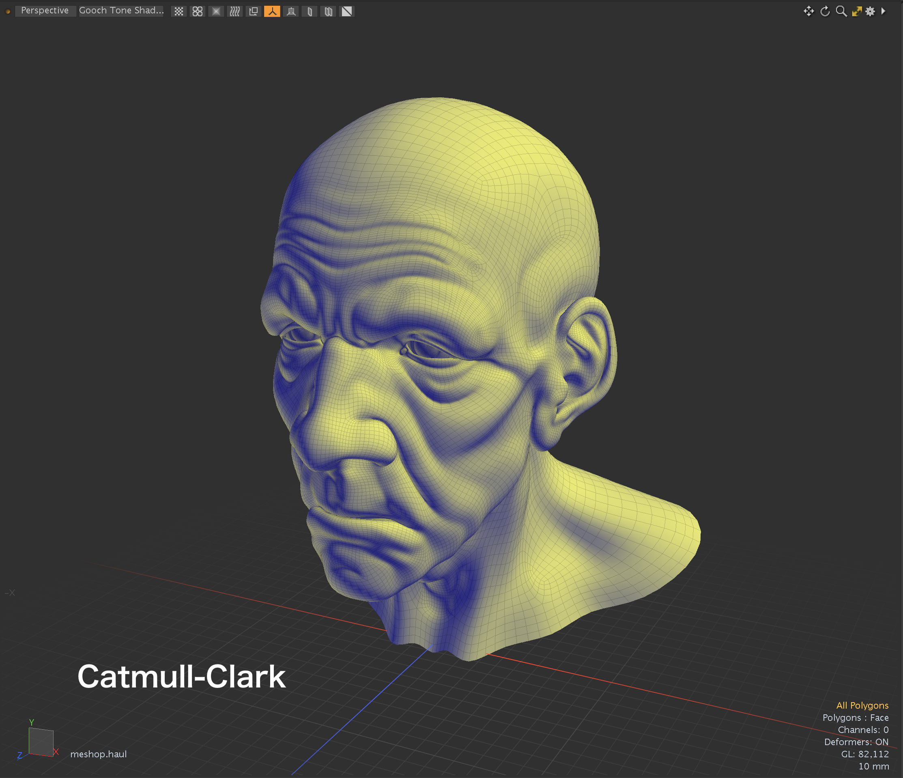
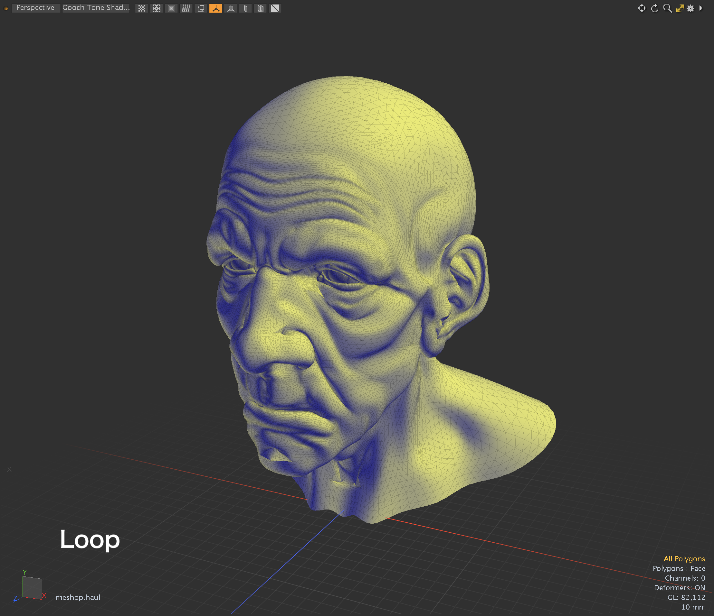
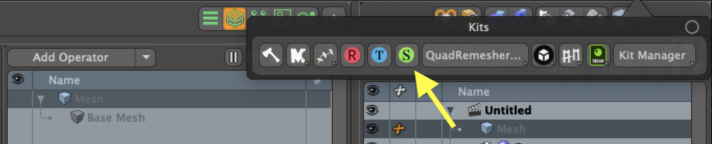

# OpenSubdiv Kit for Modo plug-in
This is a Modo Plug-in kit to subdivide face polygons using OpenSubdiv library. This subdivion kit is useful when you want to subdivide face polygons by industry standard OpenSubdiv methods instead of standard subdivide command and mesh modifier in Modo.

This kit contains a command plugin and a procedural mesh operator for macOS, Windows and Linux.

This kit is implemented using [OpenSubdiv](https://github.com/PixarAnimationStudios/OpenSubdiv) libraray.

## Installing
- Download lpk from releases. Drag and drop into your Modo viewport. If you're upgrading, delete previous version.

## How to use the plugins
- The command version of subdivision can be launched from "Kits" button on Modo UI at right-up. "poly.osd" command is mapped at "S" button.  
- The procedural mesh operator version is available on Mesh Operator viewport. That is categorized in Polygon tab.

## Options
The options in this kit are the same as those provided by OpenSubdiv. See [OpenSubdiv doc](https://graphics.pixar.com/opensubdiv/docs/subdivision_surfaces.html#schemes-and-options) for more detail.  

## Subdivision Level
Subdivision Level specifies to what degree an subdivision surface is divided. 

## Scheme
Scheme specifies how to subdivide surface polygon polygons.  
- **Bilinear**: Creates new polygons with vertices that are perfectly aligned with the plane of the original polygon. This is equivalent to **Faceted** of standard poly.subdivide command.
- **Catmull-Clark**: Provides smoothing of the selected limit surface by Catmull-Clark algorithm.
- **Loop**: Subdivide trinalges by Loop subdivision algorithm.

## Boundary Interpolation
Boundary interpolation rules control how subdivision and the limit surface behave for faces adjacent to boundary edges and vertices.  
- **None**: No boundary edge interpolation is applied by default.
- **Edge Only**: A sequence of boundary vertices defines a smooth curve to which the limit surface along boundary faces extends.
- **Edge and Corner**: Similar to edge-only but the smooth curve resulting on the boundary is made to interpolate corner vertices (vertices with exactly one incident face).

## Face-varying Interpolation
Face-varying interpolation rules control control how face-varying data is interpolated both in the interior of face-varying regions. This kit supports only UV face-varying data. 
- **None**: smooth everywhere the mesh is smooth.
- **Corners Only**: linearly interpolate (sharpen or pin) corners only.
- **Corners Plus1**: Corners Only + sharpening of junctions of 3 or more regions.
- **Corners Plus2**: Corners Plus1 + sharpening of darts and concave corners.
- **Boundaries**: linear interpolation along all boundary edges and corners.
- **All**: linear interpolation everywhere (boundaries and interior).

## Chaikin Rule
The "Chaikin Rule" is a variation of the semi-sharp creasing method that attempts to improve the appearance of creases along a sequence of connected edges when the sharpness values differ.  
- **Uniform**: Apply regular semi-sharp crease rules.
- **Chaikin**: Apply "Chaikin" semi-sharp crease rules.

## Triangle Subdivision
The triangle subdivision rule is a rule added to the Catmull-Clark scheme that modifies the behavior at triangular faces to improve the undesirable surface artefacts that often result in such areas.  
- **Default**: Default Catmark scheme weights.
- **Smooth**: "Smooth triangle" weights.

## Dependencies

- LXSDK  
This kit requires Modo SDK (Modo 16.1v8 or later). Download and build LXSDK and set you LXSDK path to LXSDK_PATH in CMakeLists.txt in triagulate.
- OpenSubdiv library 3.6.0 (https://github.com/PixarAnimationStudios/OpenSubdiv)  
This also requires OpenSubdiv library. Download and build OpenSubdiv from below and set the include and library path to CMakeLists.txt in subdivide.

